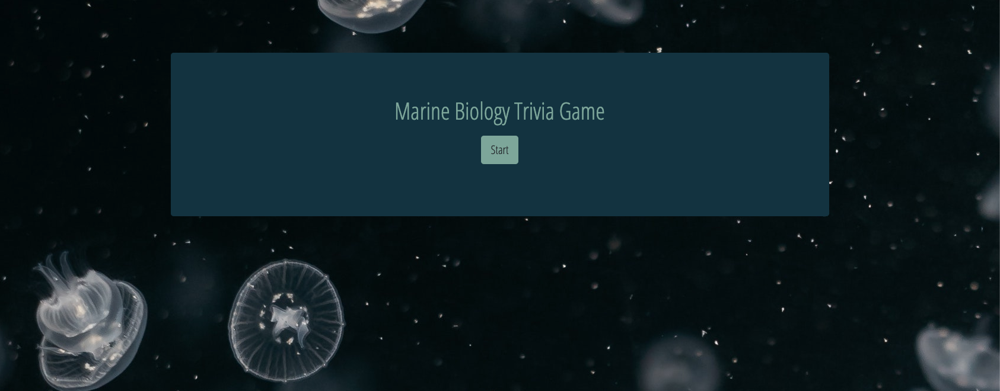
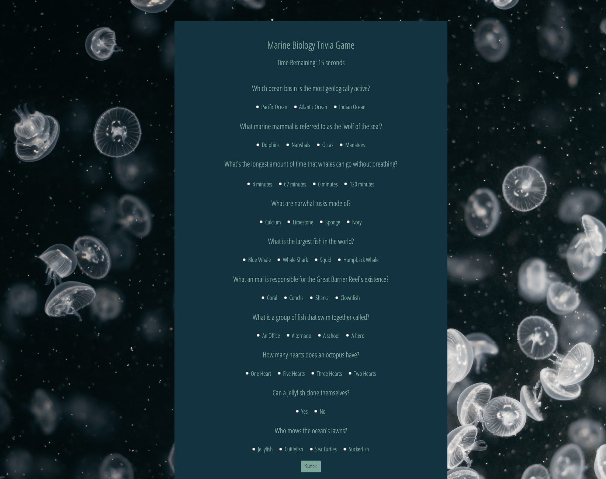

# Marine Biology Trivia Game

- Assignment #5 for UT Austin Fullstack Coding Bootcamp

- Creator: Claire Labry

This is a trivia game that is designed for the user to answer ten questions about marine animals/facts and the science behind them. The trivia game encourages the user to pick one answer, that answer is either correct or wrong. If the 30 second timer goes out, the game is over. If the user has clicked the "sumbit" button, the user has beat the computer. At the end of the game, the user will see their results, which outlines how many correct + wrong answers they have.

- User clicks start to begin the trivia game.

- User takes 10 trivia questions pertaining to marine biology

- User sees their results if they finish before the timer, or if the timer goes up before they finish, they will see correct, wrong answers and the number of unanswered questions.

- Platform created with vanilla Javascript + Bootstrap.
